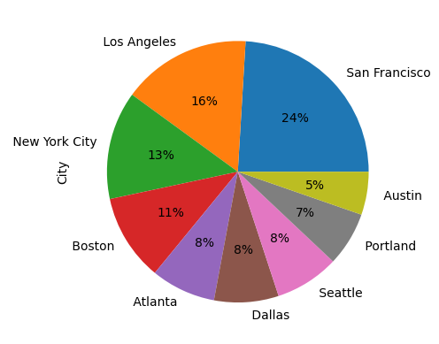
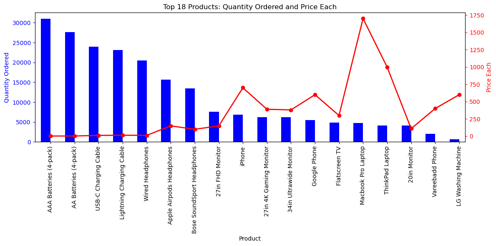
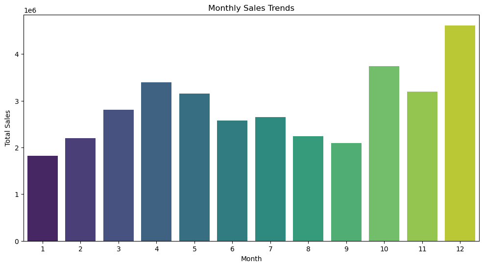

# E-Commerce Sales Optimization Case Study

## Table of Contents
1. [Introduction](#introduction)
2. [Objective](#objective)
3. [Key Insights](#key-insights)
4. [Business Recommendations](#business-recommendations)
5. [Conclusion](#conclusion)

## Introduction
In the fast-paced world of e-commerce, transforming raw sales data into actionable insights is essential for strategic decision-making. This project explores customer orders, regional sales trends, product performance, and pricing dynamics using Python (Pandas, Matplotlib) to simulate the decision-making environment of a merchandising or allocation analyst.

## Objective
- Identify best-selling products and categories by quantity and revenue.
- Understand geographic demand patterns across U.S. cities.
- Uncover seasonal trends and performance dips.
- Explore how product price relates to customer purchase behavior.
- Reveal bundling and product association opportunities.

---

## Key Insights

### 📍 Geographic Sales Distribution
- **San Francisco**, **Los Angeles**, and **New York** are not only the most active markets by order count — they also generate higher average revenue per order.
- Smaller cities like **Austin** and **Denver** show consistent volume but lower margins, suggesting discount sensitivity or different product demand.

*Figure 1: Top U.S. cities by total sales volume.*

---

### 🛍️ Top-Selling Products & Categories
- The top 10 products contribute **over 40% of all sales revenue**, indicating a high concentration of demand.
- Some high-revenue products have **lower quantity but higher price points**, suggesting a niche but profitable product strategy.

*Figure 2: Products ranked by total revenue contribution.*

---

### 📈 Monthly Sales Trends
- There's a **clear sales peak in December**, followed by a sharp **drop in January** — textbook seasonal pattern tied to holiday shopping and post-season slowdown.
- Sales rebuild slowly through Q1, implying a good time to test new product categories or pricing strategies in off-peak periods.

*Figure 3: Monthly revenue trend — seasonality pattern aligned with holiday cycle.*

---

### 💵 Price vs. Quantity Relationship
- Products priced under $500 dominate volume sales. There's a **visible decline in quantity ordered as price increases**, though a few expensive items still sell well.
- This indicates a **threshold of price sensitivity** that should be considered for bundling and upsell strategies.

*Figure 4: Price elasticity pattern — opportunity to segment pricing strategy.*

---

### 🔄 Product Association Insights
- Several product pairs are frequently ordered together — particularly **laptops and accessories**, and **smartphones with chargers/cases**.
- These associations create a strong case for **pre-built bundles** or cross-selling placements.

*Figure 5: Heatmap showing common item pairings in customer carts.*

---

## Business Recommendations

### 🎯 Geo-Targeted Promotions
- Prioritize inventory allocation and marketing spend in SF, LA, and NYC — especially during Q4.
- Offer regional discounts in price-sensitive cities to test demand elasticity.

### 🧮 Inventory Optimization
- Maintain deeper stock for top-performing SKUs across peak cities.
- Introduce limited inventory in slower-moving cities to test new item performance without overstocking.

### 💡 Smarter Pricing Strategy
- Consider introducing tiered pricing or bundle discounts for items priced over $500 to increase conversion.
- Use sales velocity and price sensitivity curves to guide markdown schedules.

### 🧠 Enhanced Cross-Selling
- Promote high-frequency item pairs as bundles.
- Use email marketing or cart recommendations to surface related accessories at checkout.

---

## Conclusion
This case study demonstrates not only how data can inform tactical retail decisions — but also how close analysis of geography, seasonality, pricing, and purchasing behavior can support strategic allocation decisions. The skills and logic applied here are directly transferable to real-world merchandising, allocation, and planning roles.

---

## Tools Used
- **Python**: Pandas, NumPy, Matplotlib, Seaborn
- **Data Skills**: Data cleaning, aggregation, correlation analysis, visual storytelling
- **Retail Concepts**: Allocation logic, revenue segmentation, geographic demand, pricing strategy
